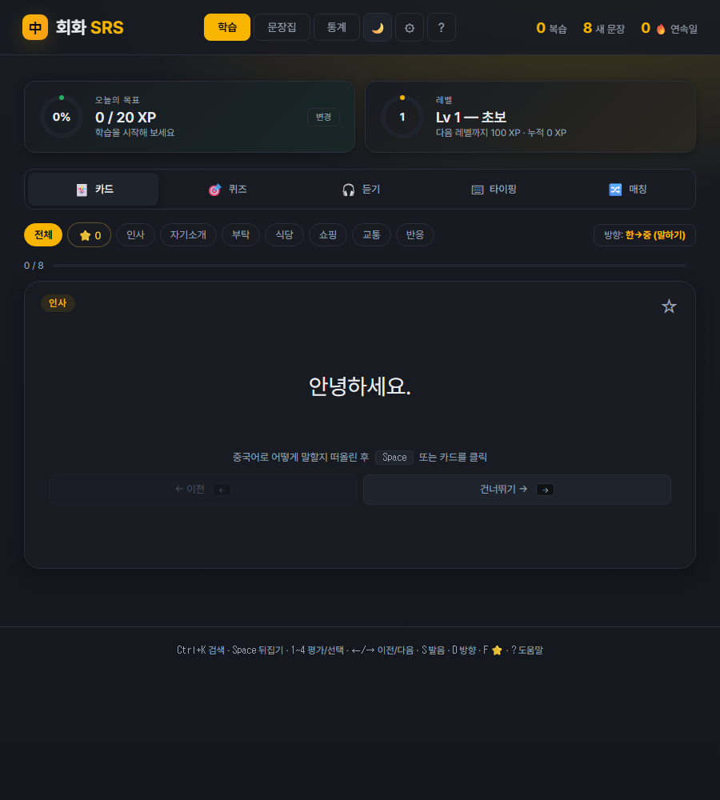
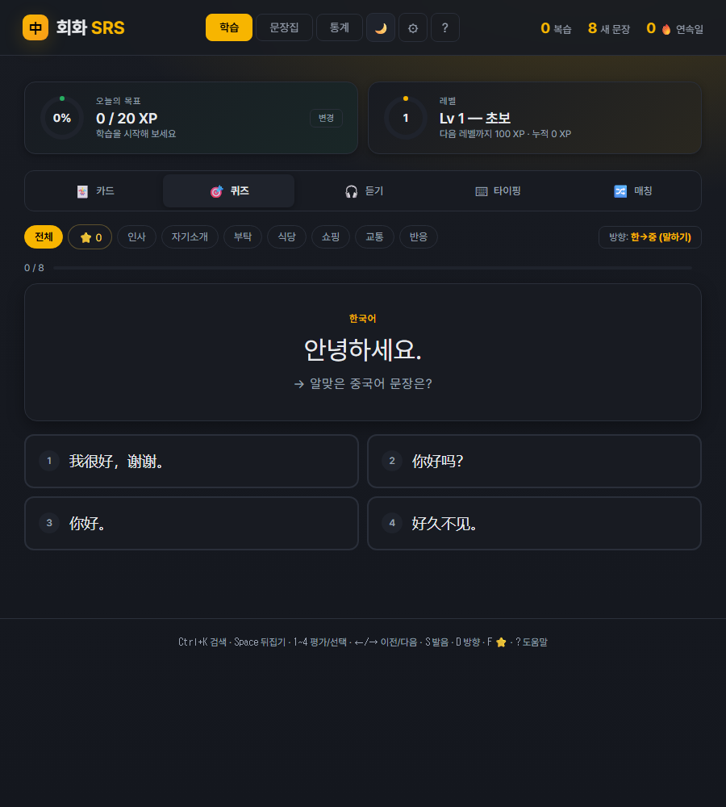
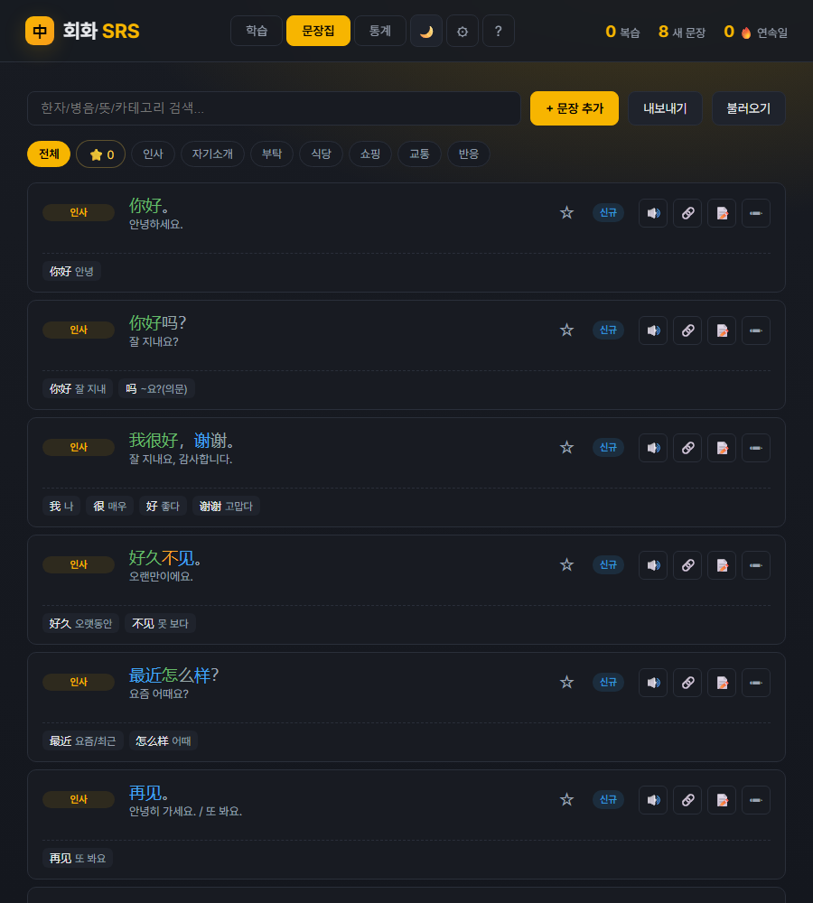
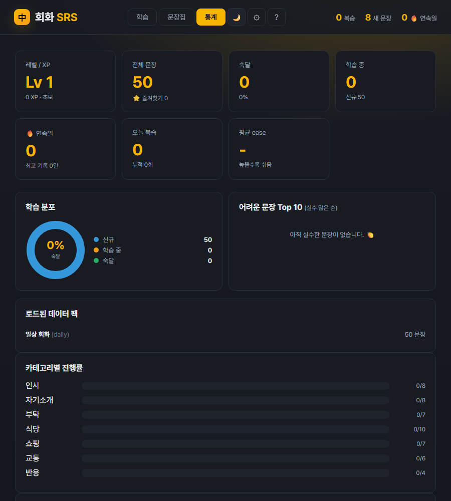

# 中文 회화 SRS

중국어 **회화 문장**을 간격 반복(SRS)으로 외우는 단일 HTML 웹앱.
서버도 빌드도 없이 `index.html`을 열면 끝이고, 진행상황은 `localStorage`에 남는다.

단어장 앱이 많은데 정작 문장이 입에 안 붙어서, 낱말 대신 **문장 단위**로 외우게 만들었다.
문장 데이터는 앱과 분리해서 `data/[팩].js` 파일 하나만 추가하면 늘어난다.
그래서 이 README의 뒷부분이 통째로 **데이터 팩 추가 가이드**다.

## 화면

같은 문장을 다섯 가지 모드로 돌린다. 카드 · 퀴즈 · 듣기 · 타이핑 · 매칭.





타이핑 모드는 병음 성조 키패드를 붙여서 `ǎ` 같은 글자를 바로 넣을 수 있다.


문장집에서 검색·필터로 찾고, 통계에서 학습 분포와 카테고리별 진행률을 본다.






## 폴더 구조

```
중국어 공부/
  index.html        # 학습 앱 (HTML+JS+CSS 단일 파일)
  data/
    _packs.js       # 팩 레지스트리 초기화. 항상 가장 먼저 로드.
    daily.js        # 일상 회화 50문장
    [팩이름].js      # ← 새 팩 추가 위치
  README.md         # 이 파일
```

브라우저에서 `index.html`을 더블클릭으로 열면 됩니다. 외부 서버나 빌드 도구 필요 없음.

## 새 팩 추가 방법 (사람용)

1. `data/[팩이름].js` 파일 만들기 (예: `data/business.js`)
2. 아래 "팩 파일 형식" 그대로 채우기
3. `index.html` 안의 `<!-- 팩 로드 -->` 주석 아래에 한 줄 추가:
   ```html
   <script src="data/business.js"></script>
   ```
4. 브라우저 새로고침. 학습 진행상황은 보존됨 (`localStorage`).

이미 학습 중인 카드 ID는 건드리지 않음. 새 ID만 자동으로 머지됨.

## 새 팩 추가 방법 (AI 봇용 프롬프트 템플릿)

다른 챗봇/AI에게 새 팩을 만들어달라고 할 때, 아래 프롬프트를 그대로 복사해 쓰면 됩니다.

````
중국어 회화 학습 앱에 추가할 데이터 팩을 만들어줘.

## 형식 (JS 파일)
```js
window.SEED_PACKS.push({
  id: '[팩ID, 영문 소문자]',
  name: '[표시명, 한국어]',
  cards: [
    {
      id: '[팩ID]_001',        // 고유 ID. 한 번 정하면 절대 바꾸지 말 것 (학습 진행상황의 키)
      cat: '[카테고리 한국어]',  // 예: '인사', '식당', '비즈니스'
      h: '中文句子。',          // 중국어 문장 (한자, 구두점 포함 가능)
      p: ['음절','배열'],       // 병음 배열. 한자 글자 수와 정확히 같아야 함. 성조 부호 포함 (mā, má, mǎ, mà, ma)
      t: [1,2],                 // 성조 배열. p와 같은 길이. 1=평성, 2=상승, 3=하강상승, 4=하강, 5=경성
      m: '한국어 의미',
      w: [                      // 단어 분절 (선택이지만 강력 권장). 단어별 한자+의미.
        { z: '中文', m: '중국어' },
        { z: '句子', m: '문장' }
      ],
      notes: '사용 팁 (선택, 짧은 한 줄)'
    },
    // ...
  ]
});
```

## 규칙
- ID는 `[팩ID]_001`, `[팩ID]_002`... 식으로 3자리 0패딩 순번
- 병음에는 반드시 성조 부호를 직접 박을 것 (`ni hao` ✗ / `nǐ hǎo` ✓)
- `p`와 `t`의 길이는 한자 글자 수와 일치 (구두점 제외, 儿화의 儿은 카운트 제외 — `一点儿` = 음절 2개)
- `w` (단어 분절): 단어들의 한자 글자 수 합 = `p` 길이. `好久不见`은 `[{z:'好久',m:'오랫동안'},{z:'不见',m:'못 보다'}]`처럼 의미 단위로 묶기 (글자별 X). 표시명을 직관적으로 — "好久=좋다+오래"가 아니라 "好久=오랫동안"
- `notes`는 진짜 알면 도움 되는 짧은 팁만 (생략 가능)
- 카테고리는 너무 잘게 쪼개지 말고 5~8개 정도로 묶기
- 한 번에 30~80문장 정도가 적당

## 요청
[팩 주제: 예) 비즈니스 회의, 호텔 체크인, 여행, 병원, 데이트 등]
[원하는 문장 수: 예) 50문장]
[난이도: HSK 2-3급 수준]
````

이 프롬프트를 다른 AI에 보내면, 위 형식대로 JS 파일을 만들어 줍니다. 그 파일을 `data/`에 넣고 `index.html`에 스크립트 한 줄 추가하면 끝.

## 데이터 모델 상세

```ts
// Card (한 문장)
type Card = {
  id: string;       // 팩 내 고유 (예: 'daily_001'). 변경하지 말 것.
  cat: string;      // 카테고리 (한국어)
  h: string;        // 중국어 문장 (한자 + 구두점)
  p: string[];      // 병음 음절 배열 (한자 수와 동일, 구두점·儿화 儿 제외)
  t: number[];      // 성조 배열 (p와 동일 길이, 1~5)
  m: string;        // 한국어 의미
  w?: { z: string; m: string }[]; // 단어 분절. z의 한자 글자 수 합 = p 길이
  notes?: string;   // 사용 팁 (선택)
};

// Pack (팩 1개)
type Pack = {
  id: string;       // 팩 식별자 (영문 소문자)
  name: string;     // 표시명 (한국어)
  cards: Card[];
};
```

## localStorage 키

| 키 | 용도 |
|----|------|
| `zh_cards_v2` | 학습 카드 + SRS 상태 (시드 + 사용자 추가/편집분 머지된 결과) |
| `zh_log_v1` | 일별 복습 횟수 (히트맵용) |
| `zh_prefs_v1` | 학습 방향, 선택 카테고리 등 |
| `zh_deleted_ids_v1` | 사용자가 삭제한 카드 ID 셋 (새 팩 머지 시 다시 살아나지 않게) |

## 알려진 한계

- `file://` 프로토콜에서 동작하려면 데이터를 `.js` 파일에 wrap해야 함 (그래서 JSON이 아닌 JS 형식). JSON으로 가려면 `python -m http.server` 같은 로컬 서버 필요.
- 한자 글자별 색깔 매핑은 한자 글자 수와 `p`/`t` 길이가 같아야 정확함. 구두점은 자동 처리됨.
- 한국 이름같이 한자가 아닌 한국어 글자가 섞이면 그 부분은 색 없음으로 표시됨.
